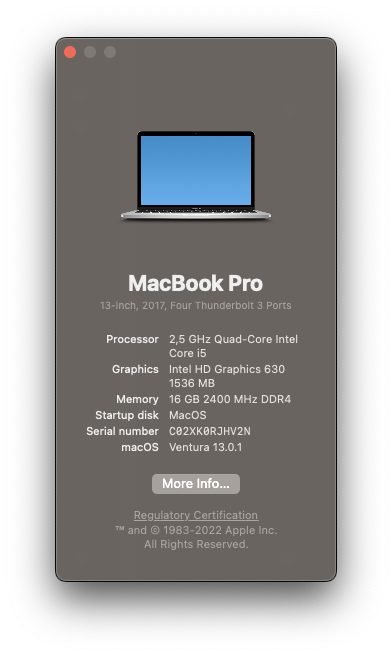
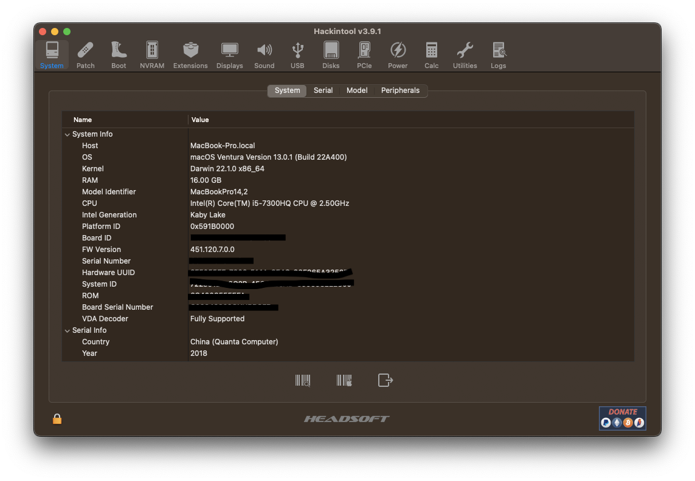
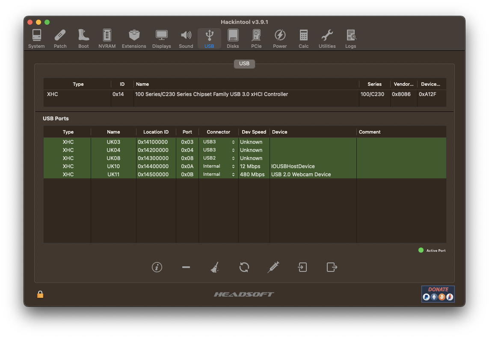

# MSI-GV62-7RD-Opencore-Hackintosh

Experience of successful hackintosh with Opencore bootloader, applied to MSI GV62 7RD laptop. It is currently running macOS Ventura 13.0.1 with no major problems.

# Computer characteristics

- CPU: Intel Core i5-7300HQ
- iGPU: Intel HD Graphics 630
- dGPU: Nvidia GTX 1050 4GB
- RAM: 16GB DDR4 2400MHz
- SSD: 256GB
- HDD: 1TB
- Audio: Realtek ALC899
- Ethernet: Realtek RTL8168H/8111H

# What is working

- Hardware acceleration: Working ✅
- Sleep: Working ✅
- Audio: Working ⚠️ (Inconsistent. When it doesn't work, going to sleep and waking up again fixes it)
- Ethernet: Working ✅
- Wifi: Working ✅
- Bluetooth: Working ✅
- HDMI: Working ✅
- USB: Working ✅
- Trackpad and keyboard: Working ✅
- Battery management: Working ✅
- iServices: Working ✅
- DRM: Not Working ❌ (Netflix, Amazon Prime Video, etc on Safari. It works on the other browsers. But HBO Max is at 720p max.)
- Sidecar, Handoff or Continuity: Not Working ❌
- AirDrop: Not Working ❌ (Because of unsupported Wifi card)

All the essential things are working. I'm using it as my daily OS. It is installed on my SSD and Windows 11 on my HDD. Working fine but Windows is a bit slow.

# Opencore configuration

- Opencore version: 0.8.4
- SMBIOS: MacBookPro14,2 (This is because I have an unsupported dGPU, so I **must** use a SMBIOS with no dGPU in order to use HDMI)
- USB mapping: Done with Hackintool. Beware of the type of USB ports.

- boot-args: `keepsyms=1 debug=0x100 alcdelay=1000 swd_panic=1 -wegnoegpu -igfxonln=1`
